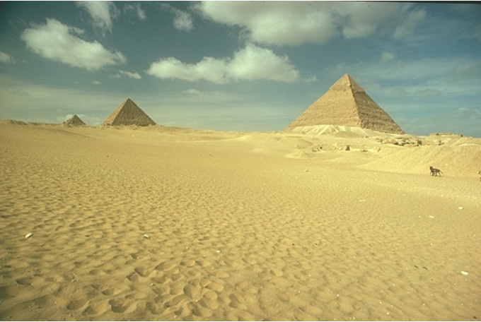
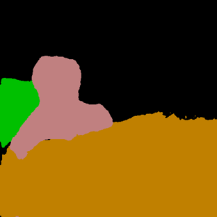
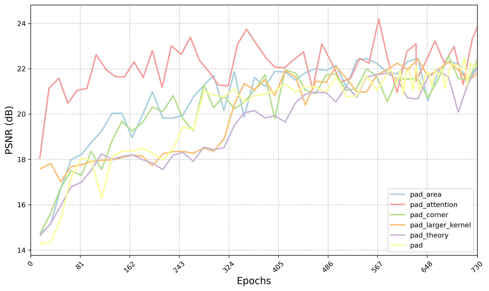

# Deep Fourier Up-Sampling in image De-raining and Segmentation

This repository is the official implementation of [Deep Fourier Up-Sampling in image De-raining and Segmentation](https://arxiv.org/abs/2030.12345). 

<p align="center">
  
  
</p>
<p align="center">
  
  
</p>

## Preparation 

### Environment

```bash
conda create <env name> python==3.9
cd LPNetDeraining
pip install -r requirements.txt
```
 
### Dataset
We use the RainTrainH_modified and Rain100H for training and evaluation respectively, which can be downloaded from the [PReNet GitHub repository](https://github.com/csdwren/PReNet/tree/master/datasets). To ensure proper pairing between low-quality and ground-truth images, rename all files in `gt/` and `lq/` folders with consistent numeric names. You can use `changeFileName.py` to achieve this (probably some modifications needed).


## Training

To train the lpnet models used in the paper, we need to modify some files. Let's take pad_theory model as example.

In `LPNetDeraining/options/train/pad_theory.yml`, please update these configurations.
```yaml
# Ground truth and input (rainy) image paths
dataroot_gt: /home/haojd/Fourier/deraining/lpnet/datasets/RainTrainH/norain
dataroot_lq: /home/haojd/Fourier/deraining/lpnet/datasets/RainTrainH/rain

# Validation image path
dataroot_gt: /home/haojd/Fourier/deraining/lpnet/datasets/Rain100H
dataroot_lq: /home/haojd/Fourier/deraining/lpnet/datasets/Rain100H/rainy

# Network architecture (must match the training config)
network_g:
  type: LPNet_pad_theory
```
Then run training with:

```bash
cd LPNetDeraining/basicsr
python train.py -opt options/train/pad_theory.yml
```

## Evaluation

To inference the trained models, we need to modify some files. Let's also take pad_theory model as example.
In `LPNetDeraining/options/test/pad_theory.yml`, please update these configurations.
```yaml
# Ground truth and input (rainy) image paths
dataroot_gt: /scratch/eecs568s001w25_class_root/eecs568s001w25_class/yiweigui/Deep-Fourier-Upsampling/Dataset/Rain100H/norain
dataroot_lq: /scratch/eecs568s001w25_class_root/eecs568s001w25_class/yiweigui/Deep-Fourier-Upsampling/Dataset/Rain100H/rainy

# Pretrained model path
path:
  pretrain_network_g: /scratch/eecs568s001w25_class_root/eecs568s001w25_class/yiweigui/Deep-Fourier-Upsampling/Pretrained_model/pad_fusion_v2/net_g_4500.pth

# Network architecture (must match the training config)
network_g:
  type: LPNet_pad_theory
```
Then run inferencing with:
```bash
cd LPNetDeraining/basicsr
python test.py -opt options/test/pad_theory.yml
```

## Pre-trained Models

The pre-trained models used in paper are saved in `PretrainedModel folder`. You are free to download and validate our results.

## Results
### Training Results for Different Modified Fourier-up Variants

### Quantitative Results on Rain200H

| Model  | Configurations     | Rain200H PSNR | Rain200H SSIM |
|--------|--------------------|---------------|----------------|
| LPNet  | pad_attention      | **23.5167**   | **0.7957**     |
|        | pad_theory         | 22.3602       | 0.7453         |
|        | pad                | 22.6593       | 0.7486         |
|        | pad_larger_kernel  | 22.8351       | 0.7453         |
|        | pad_corner         | 23.0357       | 0.7563         |
|        | pad_area           | 22.8203       | 0.7497         |


## Contributing

We welcome contributions! Please follow these steps:

1. Fork the repository
2. Create a new branch (`git checkout -b feature-yourfeature`)
3. Commit your changes (`git commit -am 'Add new feature'`)
4. Push to the branch (`git push origin feature-yourfeature`)
5. Create a Pull Request

Please make sure your code follows our style guidelines.

### License

This project is licensed under the MIT License.