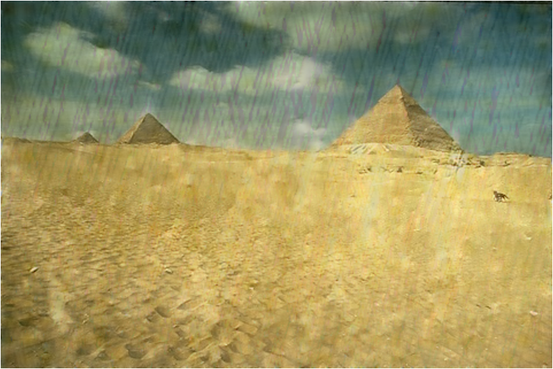

# Deep Fourier Up-Sampling in image De-raining and Segmentation

This repository is the official implementation of [Deep Fourier Up-Sampling in image De-raining and Segmentation](https://arxiv.org/abs/2030.12345). 

<p align="center">
  
  
</p>
<p align="center">
  
  
</p>

# Stage 1 Deep Fourier Up-Sampling in image De-raining
## Preparation 

### Environment

```bash
conda create <env name> python==3.9
cd LPNetDeraining
pip install -r requirements.txt
```
 
### Dataset
We use the RainTrainH_modified and Rain100H for training and evaluation respectively, which can be downloaded from the [PReNet GitHub repository](https://github.com/csdwren/PReNet/tree/master/datasets). To ensure proper pairing between low-quality and ground-truth images, rename all files in `gt/` and `lq/` folders with consistent numeric names. You can use `changeFileName.py` to achieve this (probably some modifications needed).


## Training

To train the lpnet models used in the paper, we need to modify some files. Let's take pad_theory model as example.

In `LPNetDeraining/options/train/pad_theory.yml`, please update these configurations.
```yaml
# Ground truth and input (rainy) image paths
dataroot_gt: /home/haojd/Fourier/deraining/lpnet/datasets/RainTrainH/norain
dataroot_lq: /home/haojd/Fourier/deraining/lpnet/datasets/RainTrainH/rain

# Validation image path
dataroot_gt: /home/haojd/Fourier/deraining/lpnet/datasets/Rain100H
dataroot_lq: /home/haojd/Fourier/deraining/lpnet/datasets/Rain100H/rainy

# Network architecture (must match the training config)
network_g:
  type: LPNet_pad_theory
```
Then run training with:

```bash
cd LPNetDeraining/basicsr
python train.py -opt options/train/pad_theory.yml
```

## Evaluation

To inference the trained models, we need to modify some files. Let's also take pad_theory model as example.
In `LPNetDeraining/options/test/pad_theory.yml`, please update these configurations.
```yaml
# Ground truth and input (rainy) image paths
dataroot_gt: /scratch/eecs568s001w25_class_root/eecs568s001w25_class/yiweigui/Deep-Fourier-Upsampling/Dataset/Rain100H/norain
dataroot_lq: /scratch/eecs568s001w25_class_root/eecs568s001w25_class/yiweigui/Deep-Fourier-Upsampling/Dataset/Rain100H/rainy

# Pretrained model path
path:
  pretrain_network_g: /scratch/eecs568s001w25_class_root/eecs568s001w25_class/yiweigui/Deep-Fourier-Upsampling/Pretrained_model/pad_fusion_v2/net_g_4500.pth

# Network architecture (must match the training config)
network_g:
  type: LPNet_pad_theory
```
Then run inferencing with:
```bash
cd LPNetDeraining/basicsr
python test.py -opt options/test/pad_theory.yml
```

## Pre-trained Models

The pre-trained models used in paper are saved in `PretrainedModel folder`. You are free to download and validate our results.

## Results
### Training Results for Different Modified Fourier-up Variants

### Quantitative Results on Rain200H

| Model  | Configurations     | Rain200H PSNR | Rain200H SSIM |
|--------|--------------------|---------------|----------------|
| LPNet  | pad_attention      | **23.5167**   | **0.7957**     |
|        | pad_theory         | 22.3602       | 0.7453         |
|        | pad                | 22.6593       | 0.7486         |
|        | pad_larger_kernel  | 22.8351       | 0.7453         |
|        | pad_corner         | 23.0357       | 0.7563         |
|        | pad_area           | 22.8203       | 0.7497         |


#Stage 2 Apply Fourier Up-sampling & self-attention in DeepLabV3Plus (Image Segementation)
## Preparation 

### Environment

```bash
conda create <env name> python==3.9
cd DeepLabV3Plus-Pytorch
pip install -r requirements.txt
```
 
### Dataset
The preparation of the dataset was learned from [DeepLabV3Plus-Pytorch](https://github.com/VainF/DeepLabV3Plus-Pytorch)
#### 2.1 Standard Pascal VOC
You can run train.py with "--download" option to download and extract pascal voc dataset. The defaut path is './datasets/data':

```
/datasets
    /data
        /VOCdevkit 
            /VOC2012 
                /SegmentationClass
                /JPEGImages
                ...
            ...
        /VOCtrainval_11-May-2012.tar
        ...
```

#### 2.2  Pascal VOC trainaug (Recommended!!)
See chapter 4 of [2]

        The original dataset contains 1464 (train), 1449 (val), and 1456 (test) pixel-level annotated images. We augment the dataset by the extra annotations provided by [76], resulting in 10582 (trainaug) training images. The performance is measured in terms of pixel intersection-over-union averaged across the 21 classes (mIOU).

*./datasets/data/train_aug.txt* includes the file names of 10582 trainaug images (val images are excluded). Please to download their labels from [Dropbox](https://www.dropbox.com/s/oeu149j8qtbs1x0/SegmentationClassAug.zip?dl=0) or [Tencent Weiyun](https://share.weiyun.com/5NmJ6Rk). Those labels come from [DrSleep's repo](https://github.com/DrSleep/tensorflow-deeplab-resnet).

Extract trainaug labels (SegmentationClassAug) to the VOC2012 directory.

```
/datasets
    /data
        /VOCdevkit  
            /VOC2012
                /SegmentationClass
                /SegmentationClassAug  # <= the trainaug labels
                /JPEGImages
                ...
            ...
        /VOCtrainval_11-May-2012.tar
        ...
```

### 3. Training on Pascal VOC2012 Aug

#### 3.1 Visualize training (Optional)

Start visdom sever for visualization. Please remove '--enable_vis' if visualization is not needed. 

```bash
# Run visdom server on port 28333
visdom -port 28333
```

#### 3.2 Training with OS=16

Run main.py with *"--year 2012_aug"* to train your model on Pascal VOC2012 Aug. You can also parallel your training on 4 GPUs with '--gpu_id 0,1,2,3'

**Note: There is no SyncBN in this repo, so training with *multple GPUs and small batch size* may degrades the performance. See [PyTorch-Encoding](https://hangzhang.org/PyTorch-Encoding/tutorials/syncbn.html) for more details about SyncBN**

```bash
python main.py --model deeplabv3plus_mobilenet --enable_vis --vis_port 28333 --gpu_id 0 --year 2012_aug --crop_val --lr 0.01 --crop_size 513 --batch_size 16 --output_stride 16
```

#### 3.3 Continue training

Run main.py with '--continue_training' to restore the state_dict of optimizer and scheduler from YOUR_CKPT.

```bash
python main.py ... --ckpt YOUR_CKPT --continue_training
```

#### 3.4. Testing

Results will be saved at ./results.

```bash
python main.py --model deeplabv3plus_mobilenet --enable_vis --vis_port 28333 --gpu_id 0 --year 2012_aug --crop_val --lr 0.01 --crop_size 513 --batch_size 16 --output_stride 16 --ckpt checkpoints/best_deeplabv3plus_mobilenet_voc_os16.pth --test_only --save_val_results
```

## Pre-trained Models

The pre-trained models used in paper are saved in `PretrainedModel folder`. You are free to download and validate our results.

## Results
### Training Results for Different Modified Fourier-up Variants

### Quantitative Results on Rain200H


## Contributing

We welcome contributions! Please follow these steps:

1. Fork the repository
2. Create a new branch (`git checkout -b feature-yourfeature`)
3. Commit your changes (`git commit -am 'Add new feature'`)
4. Push to the branch (`git push origin feature-yourfeature`)
5. Create a Pull Request

Please make sure your code follows our style guidelines.

## Reference

[1] [Rethinking Atrous Convolution for Semantic Image Segmentation](https://arxiv.org/abs/1706.05587)

[2] [Encoder-Decoder with Atrous Separable Convolution for Semantic Image Segmentation](https://arxiv.org/abs/1802.02611)

### License

This project is licensed under the MIT License.
